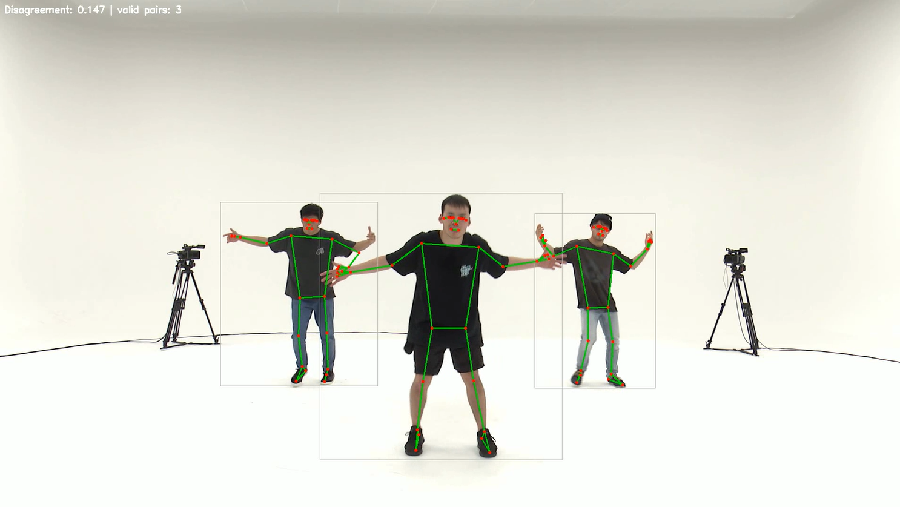
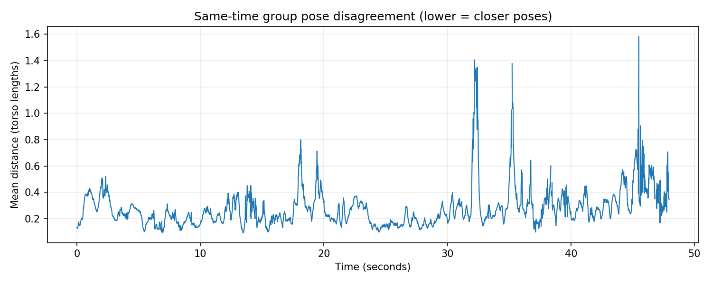

# DanceSync

A small baseline for **same-time 2D pose agreement** among people performing the
same choreography. Pretrained YOLO detects people, MediaPipe estimates poses, and
NumPy compares normalized joints. Lower disagreement means closer poses; it is
not a synchronization percentage, a timing-offset estimate, or a dance-quality grade.

## Example

Analysis of a front-view clip from the **AIST Dance Video Database**.
See [source attribution and usage terms](docs/example-source.md).



The selected frame has three valid dancer pairs and a mean distance of 0.147 torso
lengths. Boxes are person detections; visible points and lines are estimated
landmarks. The screenshot's exact frame index was not recorded.



Peaks may reflect pose differences, estimation errors, or changes in visible people
and joints. Their causes have not been individually labeled. Inspect the overlay
and valid-pair counts alongside the curve rather than interpreting every peak as a
mistake. The source imagery is subject to AIST's terms, not the MIT software license.

## Setup

Use **64-bit Python 3.10**. From the repository directory in Windows PowerShell:

```powershell
py -3.10 -m venv .venv
.\.venv\Scripts\python.exe -m pip install --upgrade pip
.\.venv\Scripts\python.exe -m pip install -r requirements.txt
.\.venv\Scripts\python.exe -m pip check
.\.venv\Scripts\python.exe -m unittest discover -s tests -v
```

No environment activation is needed. Dependencies and model weights require an
internet connection for initial setup. The inference stack is pinned; remaining
transitive dependencies are resolved by pip, so this is not a complete lockfile.
Both OpenCV wheel names are pinned to the same version because MediaPipe requires
`opencv-contrib-python` and Ultralytics requires `opencv-python`.

Download the pretrained **YOLOv8n detection** checkpoint to the repository root:

```powershell
Invoke-WebRequest -Uri "https://github.com/ultralytics/assets/releases/download/v8.3.0/yolov8n.pt" -OutFile "yolov8n.pt"
New-Item -ItemType Directory -Path data/raw -Force
```

This is the detection model, not `yolov8n-pose.pt`; MediaPipe handles pose estimation.
The full MediaPipe pose model is included in its pinned package. See the
[Ultralytics model documentation](https://docs.ultralytics.com/models/yolov8/).
Dependencies and weights retain their respective upstream licenses.

Input videos and weights are not included in Git. Put your own permitted MP4 clips
in `data/raw/`; the [example source](docs/example-source.md) provides an AIST source
link and its usage conditions. The program requires an existing local checkpoint.

## Run

Start with a short single-video check, replacing `your_video.mp4` with your filename:

```powershell
.\.venv\Scripts\python.exe main.py data/raw/your_video.mp4 --max-frames 30 --output outputs/smoke
```

Then process the entire video, or all MP4 files directly in `data/raw/`:

```powershell
.\.venv\Scripts\python.exe main.py data/raw/your_video.mp4 --output outputs/single_run
.\.venv\Scripts\python.exe main.py data/raw --output outputs/batch_run
```

With no arguments, `main.py` processes `data/raw/`. Directory inputs are sorted by
filename and are not recursive. Each video is analyzed independently, without
averaging across clips. `--max-frames` applies separately to each video.

Use a **new output folder** for each run; existing folders are rejected. Omitting
`--output` creates a timestamped folder under `outputs/`. For directory inputs,
each video gets a subfolder named after its filename without the extension.

Each video produces:

| File | Contents |
| --- | --- |
| `overlay.mp4` | Silent video with detections, landmarks, distance and valid-pair count |
| `scores.csv` | Frame, time, detection count, pose count, valid-pose count, valid-pair count and distance |
| `disagreement.png` | Per-frame distance curve; missing scores appear as gaps |

CSV frames are zero-based. Time is frame index divided by source FPS, assuming
constant-frame-rate input. Missing scores are blank, not zero. A processing error
stops a batch; completed outputs remain and the failed output may be partial.

## Method

1. Detect people with YOLOv8n at confidence >= 0.5. Clamp each bounding box to the image.
2. Estimate 33 MediaPipe landmarks on each clean crop, independently in static-image
   mode. This prevents temporal state from carrying between different dancers.
   Convert x/y coordinates back into image pixels and retain visibility estimates.
3. Select shoulders, elbows, wrists, hips, knees and ankles (12 joints). Center at
   the hip midpoint and divide by the shoulder-to-hip midpoint distance.
4. Require all four normalization anchors to be finite and have visibility >= 0.5;
   reject near-zero torso length. For each dancer pair, require at least six jointly
   reliable selected joints.
5. Average Euclidean distance over those joints, then average valid pairs equally.
   Draw overlays only after all pose extraction is complete.

For normalized coordinates `q`, the pair distance is:

```text
d(a, b) = mean over valid joints j of ||q[a, j] - q[b, j]||₂
frame disagreement = mean of valid pair distances
```

Units are torso lengths. Centering removes translation and normalization removes
uniform image scale. Orientation is retained. Visibility and joint-count cutoffs
are explicit heuristics, not optimized or calibrated thresholds.

Identity tracking is unnecessary for this unordered, same-frame group statistic.
Audio analysis, temporal alignment and smoothing are outside this baseline's scope.

## Validation

Seven tests cover translation/scale invariance, a known joint perturbation,
missing or degenerate poses, and batch input selection/output separation.
These check implementation behavior, not performance against labeled ground truth.

The following full runs were decoded back to the listed frame counts, matching
CSV rows. Counts describe **coverage, not accuracy**:

| Local clip | Frames | Frames with a score | Unavailable |
| --- | ---: | ---: | ---: |
| `input_dance_video.mp4` | 1,529 | 1,528 | 1 |
| `kuthu_vid.mp4` | 499 | 466 | 33 |
| `group_dance_front.mp4` | 2,875 | 2,860 | 15 |
| `group_dance_side_angle.mp4` | 2,555 | 2,489 | 66 |

Sampled overlays show missing poses during occlusion, deep bends and floor movement.
The side view includes dancers obscuring one another. Peaks have not been manually
labeled, and these clips are not a controlled comparison of synchronization quality
or camera angle.

An isolated environment was created on Windows with Python 3.10.0 on 2026-09-10,
independently of the original `venv/`. After installing dependencies and applying
the inference-version pins, `pip check` reported no broken requirements and all
seven tests passed. A newly downloaded YOLOv8n checkpoint processed 30 frames of
the front-view clip; verification decoded all 30 output frames, matched 30 CSV
rows, and loaded the generated plot. This is a smoke test on this platform, not a
guarantee for other operating systems or arbitrary videos.

## Limitations

- This measures simultaneous pose agreement, not temporal lag. Matching stationary
  poses can have zero distance without demonstrating synchronized movement.
- The same choreography and similar facing directions are assumed. Perspective,
  body proportions, turns and foreshortening still affect the result.
- Detections can miss people, overlap, or include spectators. Cropped poses can be
  wrong even when visibility is high. There is no identity verification.
- Changes in valid people or joints can change the score. Check coverage alongside
  the curve; a computable score does not guarantee all dancers were included.
- The group statistic cannot identify who is wrong. No labeled evaluation or
  calibrated synchronization threshold is provided.
- OpenCV stops reading at end-of-file or a decode failure, so a damaged input may
  truncate a run. The generated video omits audio.

## Files

- `main.py`: command-line input, video loop, batch processing and outputs.
- `pose.py`: person detection, independent pose extraction and drawing.
- `synchronization.py`: NumPy normalization and pairwise distances.
- `tests/`: scoring and input-selection checks.
- `docs/`: example figure assets and attribution.

Local videos, weights, environments and full generated outputs are ignored by Git.
